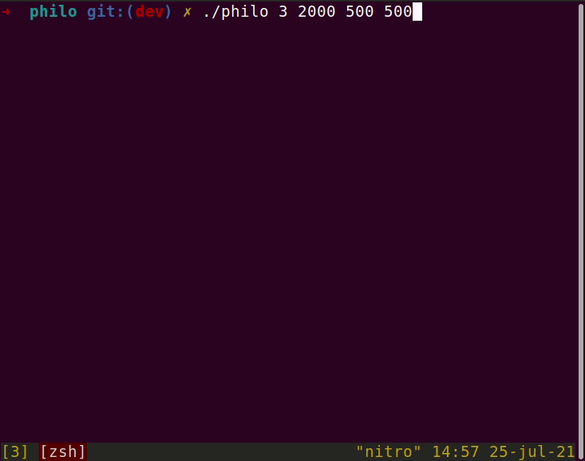

# Philosophers [](https://github.com/AdrianWR/philosophers/actions/workflows/build.yml) [](https://github.com/AdrianWR/philosophers/actions/workflows/linter.yml)

> _Economics is the science which studies human behaviour as a relationship between ends and scarce means which have alternative uses._


This is my brief take on the famous dining philosophers problem, proposed by Dijkstra in 1965. In this problem, we have a _n_ number of philosophers sitting around a circular table. The table has _n_ forks, and each philosophers disposes of a left and a right fork to use. At the center of the table lies a bowl with an unlimited supply of spaghetti, which is consumed by the philosophers with two forks.

Philosophers may eat, sleep or think before the next meal. As a philosopher must eat with two forks, there may arise situations where a philosopher must wait to take the fork shared by them neighbours. If a philosophers takes too much time before eating, they die. The aim of the problem is to create such an algorithm that lets all philosophers to live, allowing them to perform theis tasks indefinetely.

## The Problem

As unusual and alegorical the dining philosophers appears to be, the fact is that it help us to think around many problems regarding computers. We often revolve around situations where processes must access shared resources, like CPU, memory or connections from a pool. The **resource starvation** is real, and we need to take care of our systems to avoid major failovers and breakdowns.

Another situation that may arise, maybe even more struggling, is the persistence of **deadlocks**, which blocks the overall system to progress. In this project, the use of **mutual exclusion** resources is essential to avoid deadlock states.

---

## Compilation

To compile the dining philosophers binary, you must have installed `make` and `clang` on your machine. Then, run the following commands:

```shell
  git clone https://github.com/AdrianWR/philosophers
  cd philo
  make
```

## Getting Started

You may call the program by running the `./philo` binary along with the mandatory parameters to make it work, in the following sequence:

- `n`: number of philosophers on the table;
- `t_die`: time, in ms, in which a philosopher will die after eating;
- `t_eat`: time, in ms, required to eat;
- `t_sleep`: time, in ms, required to sleep.

Besides the mandatory arguments, one may choose to use an optional argument `[number_of_meals]`, describing the number of meals that each philosopher will eat before the program end of execution. If not used, the program will run indefinetely or until one philosopher dies.

```shell
./philo <n> <time_to_die> <time_to_eat> <time_to_sleep> [number_of_meals]

# Example
./philo 3 400 100 100 1
```

Let's examine the output of the example described below: three philosophers on the table, each one eating only one meal, and without possibility to die:

```shell
# Example
./philo 3 400 100 100 1

1          1 has taken a fork.
1          1 has taken a fork.
1          1 is eating.
1          3 has taken a fork.
101        1 is sleeping.
101        2 has taken a fork.
101        3 has taken a fork.
101        3 is eating.
201        3 is sleeping.
201        2 has taken a fork.
201        2 is eating.
301        2 is sleeping.
```
The first philosopher will start by taking both forks at them disposal, and they will start to eat immediately. The third philosopher can only reach its left fork, as them right one is being used by the first philosopher. The second philosopher will have to wait, as both its forks are being used. :/

As the number one finishes them meal, it'll sleep and drop both forks to be used by them neighbors. The number three can take them right fork and start to eat, and number two can take them left fork but will have to wait the third philosopher. As they finishes, number two can finally take both forks and eat, proceeding to a satisfactory nap afterwards. :) 

```shell
# Example
./philo 3 150 100 100 1

0          1 has taken a fork.
0          1 has taken a fork.
0          1 is eating.
1          3 has taken a fork.
100        1 is sleeping.
100        2 has taken a fork.
100        3 has taken a fork.
100        3 is eating.
151        2 died.
```

In this example, things change a little bit: we reduce the time until a philosopher dies, and unfortunately this has catastrophic consequences to philosopher number two. As they need to wait them neighbours, they'll have to wait both its forks, and them death comes quicker than them next meal. Truly tragic.



## Useful Links

 - [Dining Philosophers](https://en.wikipedia.org/wiki/Dining_philosophers_problem)

## License

[MIT](https://choosealicense.com/licenses/mit/)
